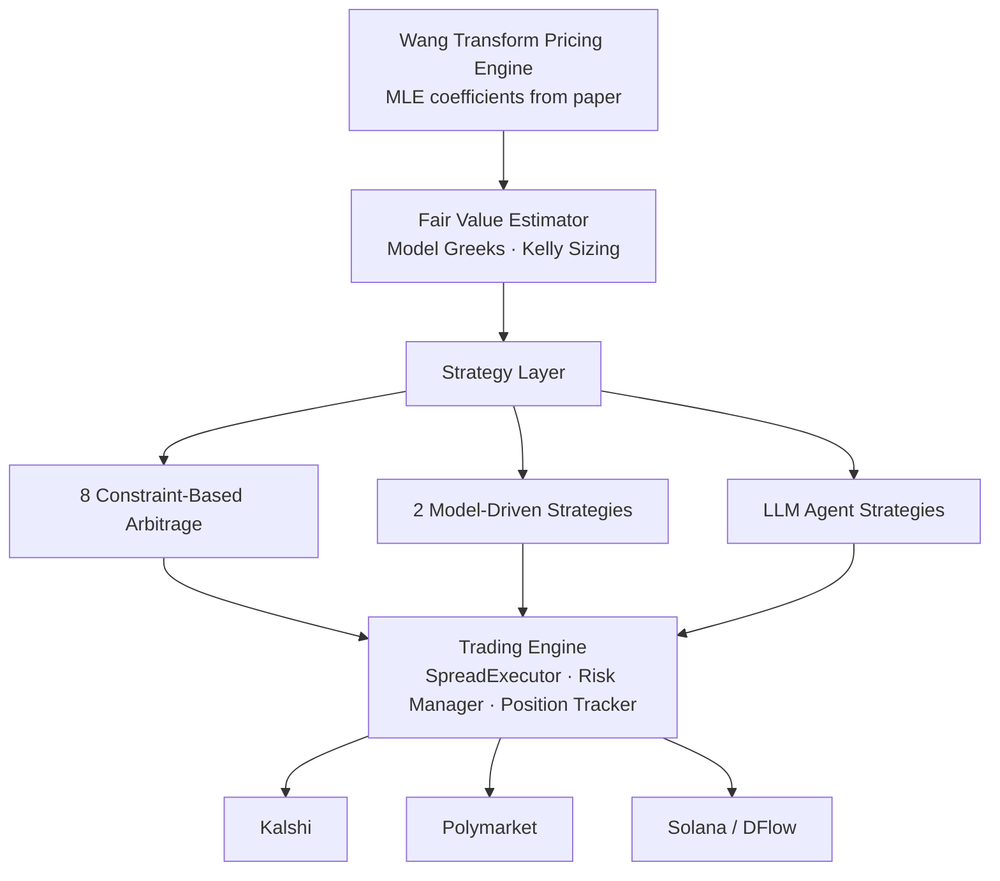

# Oracle3

**Autonomous prediction market trading agent across Kalshi, Polymarket, and Solana.**

[](https://github.com/YichengYang-Ethan/oracle3/actions)
[](https://github.com/YichengYang-Ethan/oracle3/actions)
[](https://github.com/YichengYang-Ethan/oracle3/actions)

[](LICENSE)
[](https://github.com/YichengYang-Ethan/oracle3/discussions)
[](https://github.com/YichengYang-Ethan/oracle3/commits/main)
[](https://yichengyang-ethan.github.io/oracle3/)
[](https://doi.org/10.5281/zenodo.20062549)

## Why this exists

Prediction markets price binary contracts at systematically biased levels — a true 50/50 contract typically trades around **0.57** (favorite-longshot bias, $\hat{\lambda} \approx 0.183$). Most trading bots ignore this distortion entirely. Oracle3 operationalizes a peer-reviewed pricing model, calibrated on **291,309 resolved contracts** across six venues, to systematically harvest the bias through arbitrage detection and Kelly-sized model trades.

This system deploys the exact $\lambda$ estimates and covariate model from [prediction-market-pricing](https://github.com/YichengYang-Ethan/prediction-market-pricing) (Yang, 2026) as its real-time pricing engine.

## Architecture



## Strategies

**Constraint-based arbitrage** — each exploits a violated probability axiom:

| Strategy | Invariant |
|----------|-----------|
| Cross-Market | Same event, same price across exchanges |
| Exclusivity | $P(A) + P(B) \leq 1$ for mutually exclusive events |
| Implication | $P(A) \leq P(B)$ when A implies B |
| Conditional | $P(A \mid B) \in [L, U]$ within derived bounds |
| Event Sum | $\sum P(\text{outcome}_i) = 1$ within an event |
| Structural | $P(A) = \beta \cdot P(B) + \alpha$ from calibrated model |

**Statistical arbitrage**: cointegration spread (self-calibrating z-score), lead-lag (cross-correlation).

**Model-driven**: fair value divergence (Wang-model edge), premium decay (rides predictable premium lifecycle).

## Pricing Engine

Deploys the Wang Transform from Yang (2026), calibrated on 291,309 contracts across 6 platforms:

$$p^{\text{mkt}} = \Phi\bigl(\Phi^{-1}(p^*) + \lambda\bigr), \quad \hat{\lambda} = 0.183 \; (p < 10^{-15})$$

- **Hierarchical model**: $\lambda_i = 0.259 - 0.072 \ln(1+V) + 0.143 \ln(1+D) - 0.477 |p-0.5|$
- **Model Greeks**: $\partial p / \partial \lambda$, Kelly fraction, edge decay rate
- **Online calibrator**: hybrid batch MLE + streaming EWMA with category shrinkage
- **Correlation-aware risk**: EWMA correlation matrix, effective exposure limits

> Yang, Y. (2026). *Pricing Prediction Markets: Risk Premiums, Incomplete Markets, and a Decomposition Framework.* Working Paper, UIUC. [[Replication package]](https://github.com/YichengYang-Ethan/prediction-market-pricing)

## Quick Start

```bash
git clone https://github.com/YichengYang-Ethan/oracle3.git && cd oracle3
poetry install

oracle3 market list --exchange polymarket --limit 10
oracle3 dashboard --exchange solana --initial-capital 10000
```

See [docs](https://yichengyang-ethan.github.io/oracle3/) for full CLI reference.

## Key Technical Choices

- **Event-driven async engine** with snapshot persistence and Unix socket control (pause/resume/killswitch)
- **SpreadExecutor** with automatic LIFO unwind on partial fills — no naked multi-leg positions
- **Dual-layer risk**: local position/drawdown/exposure limits + Solana `simulateTransaction` pre-flight
- **On-chain audit trail** via Solana Memo program; Jito bundle submission for MEV protection
- **633 tests**, ruff, mypy, codespell CI on every push

## Star History

[](https://star-history.com/#YichengYang-Ethan/oracle3&Date)

## Contributors

[](https://github.com/YichengYang-Ethan/oracle3/graphs/contributors)

If oracle3 helps your research or trading, please ⭐ star the repo — it helps others find it.

## License

Apache 2.0 — see [LICENSE](LICENSE) for details.

*This software is for research and educational purposes. Trading involves financial risk.*
